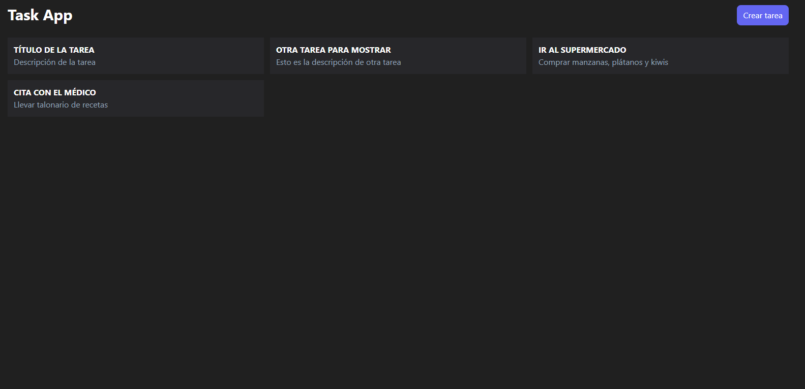
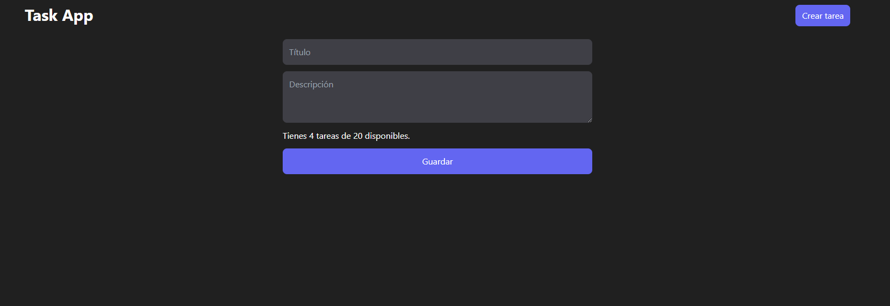
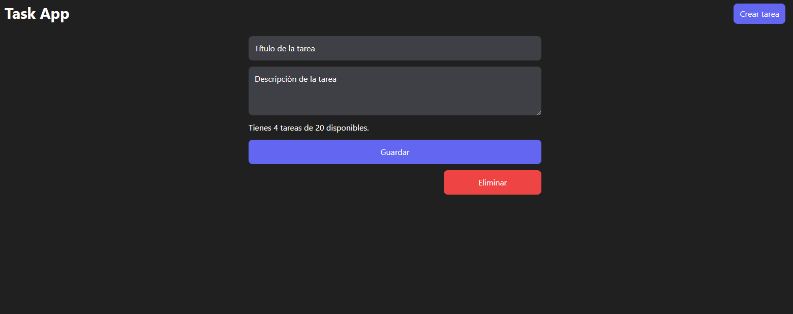

# Task App - CRUD

Añade, modifica o borra tareas almacenadas en una base de datos. (Máximo 20 tareas almacenadas). Las tareas actuales se muestran en la página de inicio.

## Stack

- Python/Django/Django REST framework
- JavaScript/React
- Tailwind CSS
- MySQL

## Links

- Live Frontend: [https://task-app-frontend-react.vercel.app/](https://task-app-frontend-react.vercel.app/)
- Live Backend (API): [https://task-app-rubpri.koyeb.app/tasks/api/v1/tasks/](https://task-app-rubpri.koyeb.app/tasks/api/v1/tasks/)
- Repositorio Backend: [https://github.com/Rubpri/task-app-backend-django](https://github.com/Rubpri/task-app-backend-django)

## Capturas 

## Perfiles

